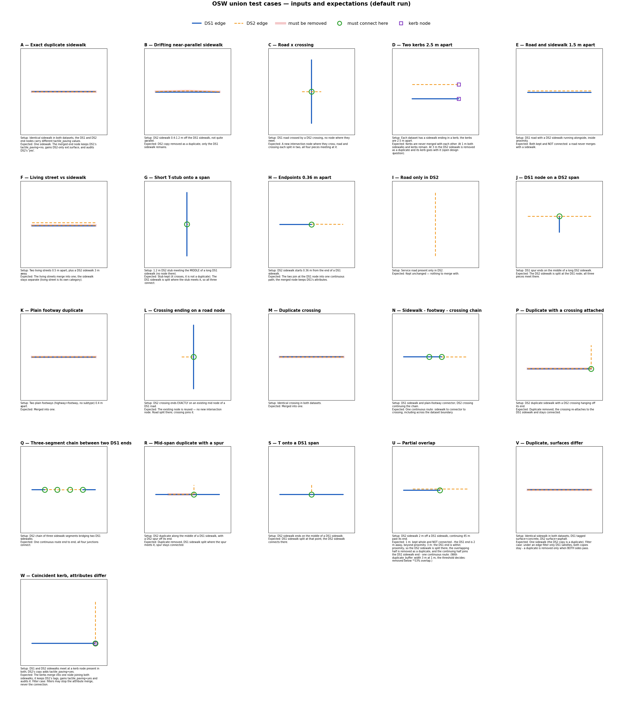

# Test dataset

Synthetic but schema-valid OSW data built to exercise `content.tdei_union_dataset`,
with one small case per behaviour.

| File | Contents |
|---|---|
| `data/ds1_nodes.geojson`, `data/ds1_edges.geojson` | Dataset 1: the authoritative side |
| `data/ds2_nodes.geojson`, `data/ds2_edges.geojson` | Dataset 2: stitched in |
| `data/expected/*.geojson` | reference layers built from the case catalogue: case areas, must-connect points, must-be-removed edges |

- **Location:** Albany, Oregon, around `-123.10, 44.63`, laid out on a ~420 m ×
  260 m grid so each case sits in its own area of the map.
- **Finding a case:** every edge carries a `name` starting with its case id
  (`"A: duplicate sidewalk"`), so you can search a viewer by name.
- **Generated, not hand-edited:** these files come from
  `harness/generate_dataset.py` (see [extending.md](extending.md)).

## Cases

| Case | Setup | Expected after union (default settings) |
|---|---|---|
| **A** | Identical sidewalk in both datasets | One copy in the output; the DS2 copy is dropped as a duplicate |
| **B** | Sidewalks 0.4–1.2 m apart, drifting (not truly parallel) | Duplicate only if the buffer is wide enough: the buffer-tuning case |
| **C** | Road (DS1) crosses a crossing (DS2), with no node where they meet | New `ixn` node minted at the intersection, snapped to 7 dp; **both** edges split at it |
| **D** | Two `barrier=kerb` nodes 2.5 m apart | Kerbs **never merged** with each other. At 3 m the DS2 sidewalk is removed as a duplicate and its kerb goes with it |
| **E** | Road and sidewalk parallel, 1.5 m apart | **Not merged**: different category, regardless of proximity |
| **F** | Two `living_street` 0.5 m apart, plus a sidewalk 3 m away | The living streets merge with each other, **never** with the sidewalk |
| **G** | 1.2 m perpendicular stub meeting the middle of a long sidewalk | **Kept and connected**: the DS1 sidewalk is split where the stub meets it. Not a duplicate: it crosses rather than runs alongside |
| **H** | DS2 sidewalk starting 0.36 m from a DS1 sidewalk end | Nodes snap together; one continuous path |
| **I** | Service road present only in DS2 | Survives untouched |
| **J** | DS1 spur ending on the interior of a long DS2 sidewalk | DS2 edge split at the DS1 node |
| **K** | Two plain footways (`highway=footway`, no subtype) 0.4 m apart | Deduplicated within the pedestrian category |
| **L** | Crossing whose endpoint sits **exactly** on an existing road node | Exact-match **reuse**: no new `ixn` node, no degenerate micro-edge |
| **M** | Identical crossing in both datasets | Deduplicated like sidewalks, within the crossing category |
| **N** | Sidewalk → plain footway → crossing chain, split across datasets | The OSW-recommended connection pattern stays connected |
| **P** | DS2 duplicate sidewalk with a DS2 crossing hanging off its end | Duplicate removed; the crossing re-points onto the DS1 node and stays connected |
| **Q** | 3-segment DS2 sidewalk chain meeting DS1 at both ends | Continuous end-to-end path; both junctions connect |
| **R** | DS2 duplicate along the middle of a DS1 sidewalk, with a spur attached | Duplicate removed; DS1 split where the spur meets it; the spur stays connected |
| **S** | DS2 sidewalk ending on the middle of a DS1 sidewalk | DS1 split at that point; the two connect |
| **U** | DS2 sidewalk 2 m off a DS1 sidewalk, continuing well past its end (**partial** overlap) | Decided by `duplicate_overlap_percentage`. With `duplicate_buffer_width: 3` about 53 % lies in the corridor: removed at 50 %, kept at 60 % |
| **V** | Identical sidewalk; DS1 `surface=concrete`, DS2 `surface=asphalt` | DS2 copy removed. **Filter case:** a duplicate is removed only when BOTH copies pass the edge filter |
| **W** | DS1 and DS2 sidewalks meeting at a coincident kerb; DS2 adds `tactile_paving=yes` | One kerb joining both; `tactile_paving` merged and audited. **Filter case:** filters may withhold the attribute, never the connection |

## Node attributes

Several coincident node pairs carry different attributes, to exercise the
property-merge and audit path. For example, at `-123.1, 44.63` (case A):

| | value |
|---|---|
| DS1 | `tactile_paving = no` |
| DS2 | `tactile_paving = yes`, `ext:surface = concrete` |

Expected on the merged node:

- `tactile_paving = no` (DS1 is authoritative)
- `ext:surface = concrete` added
- `ext:union_audit_*` recording every DS2 value, including the
  `tactile_paving = yes` that DS1 overrode

There are **6 exactly-coincident node pairs** across the two datasets. All of them
must merge, even where the two sides are different categories (case L
road/crossing, case N footway/crossing). Two nodes at the same coordinate are the
same physical point.

## Schema compliance

Built to **OpenSidewalks 0.3**. Each file declares
`"$schema": "https://sidewalks.washington.edu/opensidewalks/0.3/schema.json"`.

- All coordinates are at **7 decimal places** (system precision).
- Every edge endpoint **exactly equals** the coordinate of the node its `_u_id` /
  `_v_id` references.
- Every vertex is registered as a node, as in real OSW datasets.
- Node and edge ids are unique and numeric. There are no zero-length segments,
  and all geometry is valid.
- Every edge carries an identifying field (`footway` / `highway` / `service`), as
  the schema requires. A genuinely untyped edge is therefore not valid OSW, which
  is why no untyped-edge case exists.

Check all of this with `python3 harness/validate_dataset.py`.
